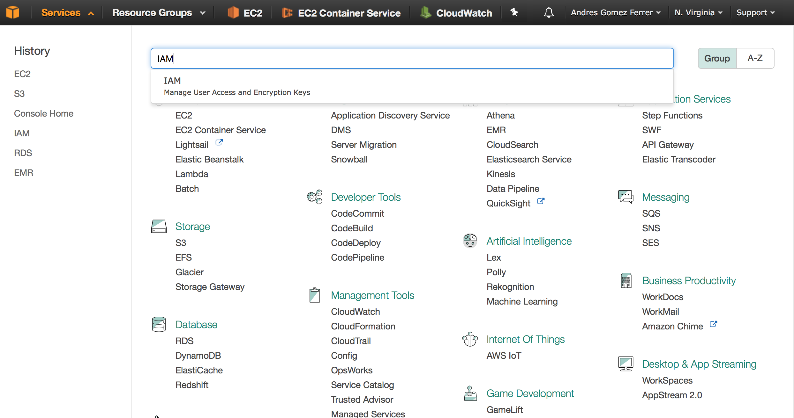
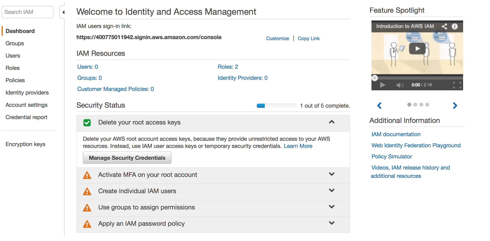
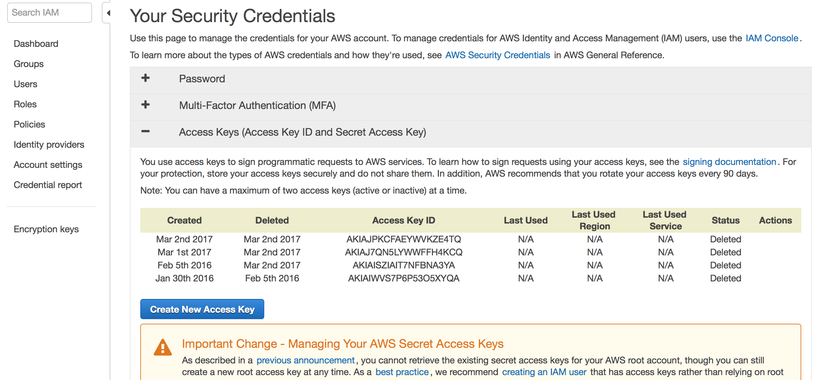
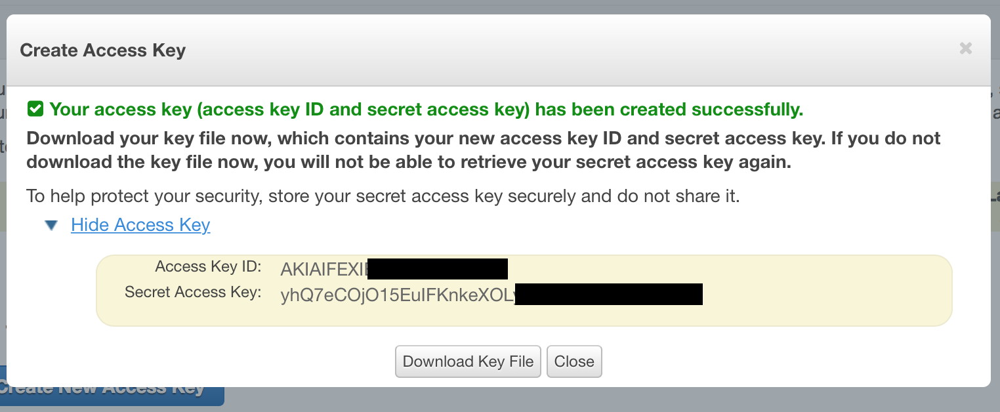
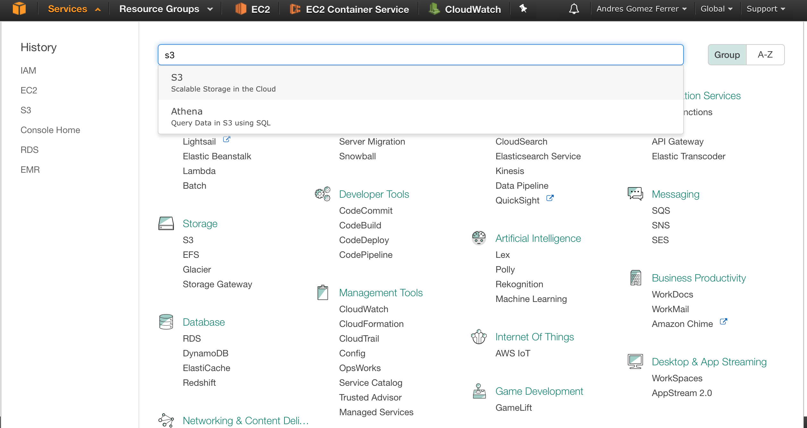
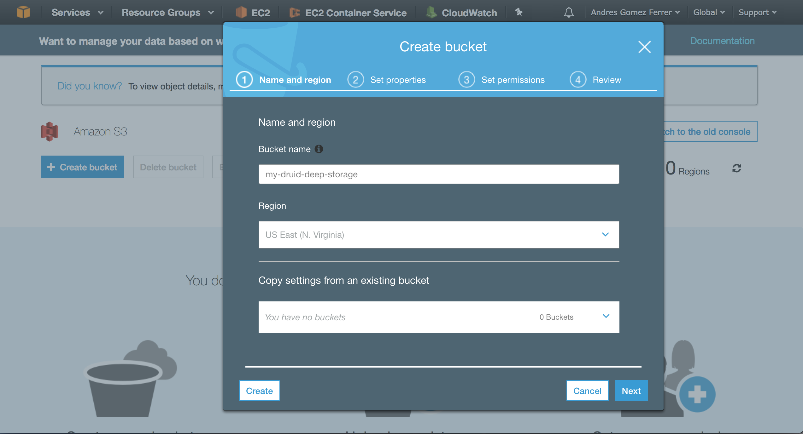
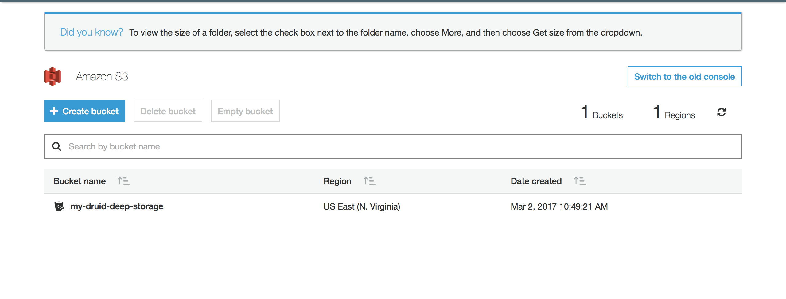
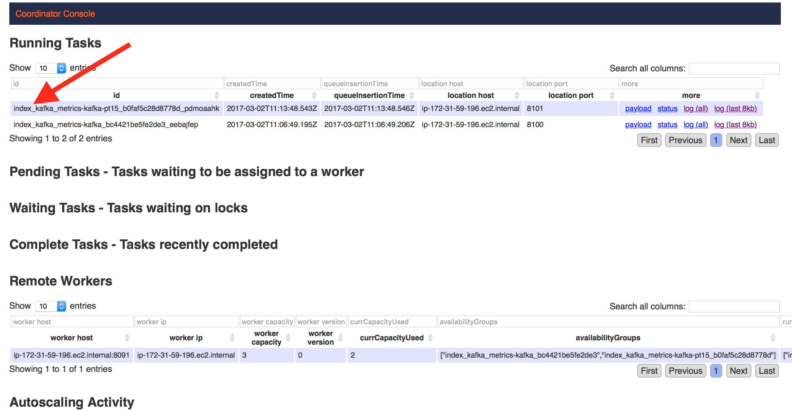
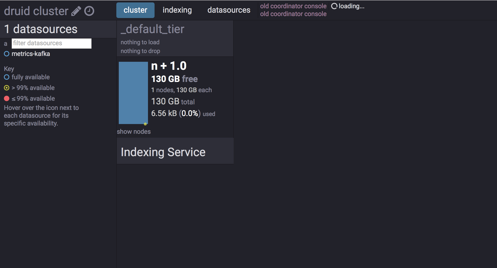
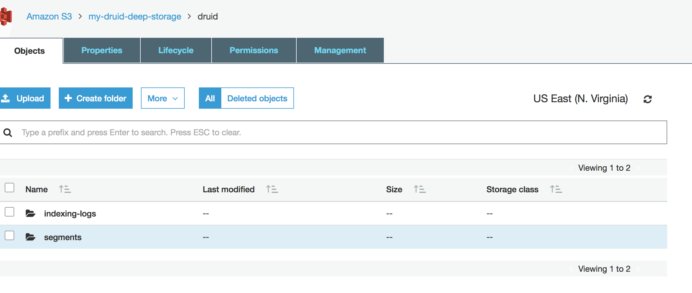

* Do not remove this line (it will not be displayed)
{:toc}

# Getting Started

En este tutorial, vamos a instalar un cluster de Druid que podrá funcionar en modo multi-nodo.
El cluster tendrá las siguientes dependencias:

* Deep Storage: S3 AWS
* Metadata Storage: PostgreSQL
* Sincronización: ZooKeeper
* Ingesta de eventos desde Kafka.

## Instalación ZooKeeper y Kafka

[Explicación Kafka](http://datadocs.xyz/kafka/)

## Instalación metadata storage (PostgreSQL)

En primer lugar vamos a instalar PostgreSQL.

Ubuntu/Debian

```
apt-get install -y postgresql
```

OSX

```
brew install postgresql
```

Una vez instalado nos cambiamos al usuario del sistema `postgres`, para gestionar la base de datos.

```
su postgres
```

Creamos un nuevo usuario en postgresql de nombre `druid` y le ponemos una contraseña en este caso `diurd`

```
createuser druid -P
```

Creamos una base de datos de nombre `druid` que pertenece al usuario que acabamos de crear.

```
createdb druid -O druid
```

Ya tenemos configurado postgresql y podemos salir del usuario `postgres`.

## Configuración AWS S3

En primer lugar para poder acceder al servicio desde S3 desde Druid se utilizaran un AccessKey y un SecretKey, entonces vamos a generarlos.

* Accedemos al panel de IAM.



* Seleccionamos `Manage Security Credentials`.



* Creamos una nueva Access Key.



* Visualizamos y descargamos las credenciales. Hay que tener en cuenta que no podremos volver a ver nuestro SecretKey desde la consola de AWS, por lo que hay que guardarla.



Una vez ya tenemos nuestras credenciales vamos a crear un Bucket de S3, que utilizaremos como Deep Storage.

* Accedemos al panel de S3.



* Seleccionamos crear Bucket, introducimos el nombre del buckey y nuestra region y seleccionamos siguiente, siguiente, siguiente y crear bucket.



* Finalmente podremos ver nuestro Bucket ya creado.



Con esto ya tenemos configurado nuestro Deep Storage para utilizarlo desde Druid.

## Instalación Druid

En primer lugar descargamos la última versión estable de Druid y la descomprimimos.

```
wget http://static.druid.io/artifacts/releases/druid-0.10.0-bin.tar.gz
```

```
tar -xvf druid-0.10.0-bin.tar.gz
```

Una vez ya tenemos la distribución, lo primero que vamos a hacer es configurar Druid para que use nuestro ZooKeeper y nuestro Deep Storage y Metadata Storage. Para ello editamos el fichero:

```
druid-dist/conf/druid/_common/common.runtime.properties
```

* Cambiamos las extensiones `druid.extensions.loadList` que utilizaremos en nuestro cluster de Druid. Dejamos las extensiones por defecto, cambiando mysql por postgresql y añadimos la extension de kafka-indexing que usaremos más adelante.

  ```properties
  druid.extensions.loadList=["druid-kafka-eight", "druid-s3-extensions", "druid-histogram", "druid-datasketches", "druid-lookups-cached-global", "postgresql-metadata-storage", "druid-kafka-indexing-service"]
  ```

* Configuramos nuestro servidor de ZooKeeper.

  ```properties
  druid.zk.service.host=localhost:2181
  ```

* Comentamos las propiedades de metadata.storage pertenecientes a derby y descomentamos la de postgresql.

  Comentamos -->

  ```properties
  druid.metadata.storage.type=derby
  druid.metadata.storage.connector.connectURI=jdbc:derby://metadata.store.ip:1527/var/druid/metadata.db;create=true
  druid.metadata.storage.connector.host=metadata.store.ip
  druid.metadata.storage.connector.port=1527
  ```
  Configuramos -->

  ```properties
  druid.metadata.storage.type=postgresql
  druid.metadata.storage.connector.connectURI=jdbc:postgresql://localhost:5432/druid
  druid.metadata.storage.connector.user=druid
  druid.metadata.storage.connector.password=diurd
  ```

* Ahora vamos a configurar nuestro Deep Storage, para eso comentamos la parte al deep storage local y descomentamos la parte de S3.

  Comentamos -->

  ```properties
  druid.storage.type=local
  druid.storage.storageDirectory=var/druid/segments
  ```
  Configuramos -->

  ```properties
  druid.storage.type=s3
  druid.storage.bucket=my-druid-deep-storage
  druid.storage.baseKey=druid/segments
  druid.s3.accessKey=AKIAIFEXIBU2R7BA----
  druid.s3.secretKey=yhQ7eCOjO15EuIFKnkeXOLyf-----
  ```

* Configuramos S3 como almacenamiento de los logs de las tareas de indexación:

  Comentamos -->

  ```properties
  druid.indexer.logs.type=file
  druid.indexer.logs.directory=var/druid/indexing-logs
  ```
  Configuramos -->

  ```properties
  druid.indexer.logs.type=s3
  druid.indexer.logs.s3Bucket=my-druid-deep-storage
  druid.indexer.logs.s3Prefix=druid/indexing-logs
  ```

Una vez configurado el fichero de `common.runtime.properties` podemos iniciar los servicios y dejar el resto de ficheros con la configuración por defecto.

```
bin/init
```

```
bin/coordinator.sh start
```

```
bin/broker.sh start
```

```
bin/historical.sh start
```

```
bin/overlord.sh start
```

```
bin/middleManager.sh start
```

Todos los logs se encuentran dentro de la carpeta `log`, en el inicio de los servicios debemos indentificar esta linea que significa que el servicio ha iniciado correctamente.

```
2017-03-02T10:53:44,593 INFO [main] org.eclipse.jetty.server.Server - Started @2914ms
```

Una vez todos los servicios se han iniciado deberiamos poder ver sus procesos utilizando:

```
root@ip-172-31-59-196:~/druid# ps aux | grep druid | grep java
root     10736  1.7  1.7 8939096 570460 pts/1  Sl   10:49   0:11 java -server -Xms3g -Xmx3g -Duser.timezone=UTC -Dfile.encoding=UTF-8 -Djava.io.tmpdir=var/tmp -Djava.util.logging.manager=org.apache.logging.log4j.jul.LogManager -Dderby.stream.error.file=var/druid/derby.log -cp conf/druid/_common:conf/druid/coordinator:lib/* io.druid.cli.Main server coordinator
root     10905  2.8  2.1 31731828 693608 pts/1 Sl   10:53   0:11 java -server -Xms24g -Xmx24g -XX:MaxDirectMemorySize=4096m -Duser.timezone=UTC -Dfile.encoding=UTF-8 -Djava.io.tmpdir=var/tmp -Djava.util.logging.manager=org.apache.logging.log4j.jul.LogManager -cp conf/druid/_common:conf/druid/broker:lib/* io.druid.cli.Main server broker
root     11017  6.3  1.6 13598160 542940 pts/1 Sl   10:57   0:09 java -server -Xms8g -Xmx8g -XX:MaxDirectMemorySize=4096m -Duser.timezone=UTC -Dfile.encoding=UTF-8 -Djava.io.tmpdir=var/tmp -Djava.util.logging.manager=org.apache.logging.log4j.jul.LogManager -cp conf/druid/_common:conf/druid/historical:lib/* io.druid.cli.Main server historical
root     11090 11.2  1.7 8924712 573360 pts/1  Sl   10:58   0:09 java -server -Xms3g -Xmx3g -Duser.timezone=UTC -Dfile.encoding=UTF-8 -Djava.io.tmpdir=var/tmp -Djava.util.logging.manager=org.apache.logging.log4j.jul.LogManager -cp conf/druid/_common:conf/druid/overlord:lib/* io.druid.cli.Main server overlord
root     11197 17.4  0.5 4968964 180244 pts/1  Sl   10:59   0:09 java -server -Xms64m -Xmx64m -Duser.timezone=UTC -Dfile.encoding=UTF-8 -Djava.io.tmpdir=var/tmp -Djava.util.logging.manager=org.apache.logging.log4j.jul.LogManager -cp conf/druid/_common:conf/druid/middleManager:lib/* io.druid.cli.Main server middleManager
```

Ahora que ya que tenemos todo el sistema funcionando, vamos a crear una tarea de indexación que consuma de un topic de kafka llamado `metrics` y guarde los datos en un dataSource.

Creamos un fichero con este contenido llamado `kafka-index.json`.

```json
{
  "type": "kafka",
  "dataSchema": {
    "dataSource": "metrics-kafka",
    "parser": {
      "type": "string",
      "parseSpec": {
        "format": "json",
        "timestampSpec": {
          "column": "timestamp",
          "format": "ruby"
        },
        "dimensionsSpec": {
          "dimensions": [],
          "dimensionExclusions": [
            "timestamp",
            "value"
          ]
        }
      }
    },
    "metricsSpec": [
      {
        "name": "count",
        "type": "count"
      },
      {
        "name": "value_sum",
        "fieldName": "value",
        "type": "doubleSum"
      },
      {
        "name": "value_min",
        "fieldName": "value",
        "type": "doubleMin"
      },
      {
        "name": "value_max",
        "fieldName": "value",
        "type": "doubleMax"
      }
    ],
    "granularitySpec": {
      "type": "uniform",
      "segmentGranularity": "HOUR",
      "queryGranularity": "NONE"
    }
  },
  "tuningConfig": {
    "type": "kafka",
    "maxRowsPerSegment": 5000000
  },
  "ioConfig": {
    "topic": "metrics",
    "consumerProperties": {
      "bootstrap.servers": "localhost:9092"
    },
    "taskCount": 1,
    "replicas": 1,
    "taskDuration": "PT1H"
  }
}
```

Para ejecutar la tarea de indexación debemos subir el fichero mediante una peticion POST al Overlord.

```
curl -X POST -H 'Content-Type: application/json' -d @kafka-index.json http://localhost:8090/druid/indexer/v1/supervisor
```

Ahora si la tarea se ha levantado podemos verificar que esta funcionando si miramos en la interfaz web del overlod

`http://${OVERLORD_IP}:8090/console.html`



Si tenemos la tarea funcionando correctamente podemos enviar datos utilizando el producer de consola de Kafka.

```
root@ip-172-31-59-196:~# date +%s
1488453335

root@ip-172-31-59-196:~# kafka/bin/kafka-console-producer.sh --broker-list localhost:9092 --topic metrics
{"timestamp":1488453335, "value":20.00, "sensor":"ABC"}
{"timestamp":1488453335, "value":20.00, "sensor":"ABC"}
{"timestamp":1488453335, "value":20.00, "sensor":"ABC"}
{"timestamp":1488453335, "value":20.00, "sensor":"ABC"}
{"timestamp":1488453335, "value":20.00, "sensor":"ABC"}
{"timestamp":1488453335, "value":20.00, "sensor":"ABC"}
{"timestamp":1488453335, "value":20.00, "sensor":"ABC"}
{"timestamp":1488453335, "value":20.00, "sensor":"ABC"}
```

Finalmente podemos realizar una query a los datos indexados para comprobar su funcionamiento.

Query:

```json
{
  "queryType": "topN",
  "dataSource": "metrics-kafka",
  "granularity": "all",
  "dimension": "sensor",
  "threshold": 1000,
  "metric": "valueSum",
  "aggregations": [
    {
      "type": "longSum",
      "name": "count",
      "fieldName": "count"
    },
    {
      "name": "valueSum",
      "fieldName": "value_sum",
      "type": "doubleSum"
    }
  ],
  "intervals": [
    "2017-03-02T11:00:00/2017-03-02T11:30:00"
  ]
}
```

```
curl -sX POST http://${BROKER_IP}:8082/druid/v2/?pretty=true -H 'content-type: application/json'  -d @query.json
```

Resultado:

```json
[
  {
    "timestamp" : "2017-03-02T11:15:35.000Z",
    "result" :
    [
      {
        "count" : 8,
        "valueSum" : 160.0,
        "sensor" : "ABC"
      }
    ]
  }
]
```

Una vez ya tenemos datos vamos a forzar la creación de un segmento, para ello vamos a apagar la tarea de indexación:

```
curl -X POST -H 'Content-Type: application/json' http://${OVERLORD_IP}:8090/druid/indexer/v1/supervisor/metrics-kafka/shutdown
```

Cuando haya finalizado podemos consultar en la web del Coordinator como ya uno de los historicals tienen segmentos cargados:

```
http://${COORDINATOR_IP}:8081/
```



y podemos veriricar en S3 AWS, que tenemos el segmento y los logs del las tareas de indexación.



Tambien podemos verificar el metadata storage.

1. Cambiamos de usuario a `druid`.

  ```
   su druid
  ```

2. Accedemos a postgresql.

  ```
  psql
  ```

3. Listamos los segmentos de la tabla correspondiente:

  ```
  SELECT * FROM druid_segments;
  ```

# Indexing Raw Data

En Druid es posible indexar mensajes en batch. Este proceso se realiza mediante una tarea de indexación de tipo `index` o `index_hadoop`.

En este caso vamos a indexar un fichero que tiene un JSON por linea. Este fichero lo tenemos comprimido en formato GZIP y esta almacenado en un bucket de S3.

El fichero de S3 contiene una muestra de datos sobre analitica de red, por lo que hemos definido las siguiente dimensiones y métricas para su indexado.


**Muestra de los datos:**

```json
{"type":"netflowv10","flow_sequence":"14982","src":"169.50.74.122","dst":"10.81.218.209","ip_protocol_version":4,"l4_proto":6,"src_port":8080,"dst_port":42256,"srv_port":8080,"input_vrf":0,"input_snmp":58,"flow_end_reason":"lack of resources","biflow_direction":"reverse initiator","application_id_name":"http-alt","engine_id_name":"IANA-L4","output_snmp":53,"output_vrf":0,"direction":"egress","client_mac":"34:64:87:a1:f6:b9","sensor_ip":"10.128.15.10","sensor_uuid":"-0e2c-42c2-8324-e3528717c0d8","sensor_name":"ISG1","first_switched":1488285163,"timestamp":1488285167,"bytes":3194,"pkts":18}
{"type":"netflowv10","flow_sequence":"14983","src":"52.209.58.155","dst":"10.82.156.135","ip_protocol_version":4,"l4_proto":6,"src_port":443,"dst_port":32795,"srv_port":443,"input_vrf":0,"input_snmp":58,"flow_end_reason":"lack of resources","biflow_direction":"reverse initiator","application_id_name":"ssl","engine_id_name":"PANA-L7","output_snmp":54,"output_vrf":0,"direction":"egress","client_mac":"ac:5f:3e:82:e6:cd","sensor_ip":"10.128.15.10","sensor_uuid":"-0e2c-42c2-8324-e3528717c0d8","sensor_name":"ISG1","first_switched":1488285165,"timestamp":1488285167,"bytes":1603,"pkts":2}
{"type":"netflowv10","flow_sequence":"15000","src":"10.81.215.178","dst":"92.122.148.144","ip_protocol_version":4,"l4_proto":6,"src_port":54757,"dst_port":80,"srv_port":80,"input_vrf":0,"input_snmp":53,"flow_end_reason":"lack of resources","biflow_direction":"initiator","application_id_name":"13:637","engine_id_name":"PANA-L7","output_snmp":58,"output_vrf":0,"direction":"ingress","client_mac":"60:a3:7d:9a:d2:ee","sensor_ip":"10.128.15.10","sensor_uuid":"-0e2c-42c2-8324-e3528717c0d8","sensor_name":"ISG1","first_switched":1488285167,"timestamp":1488285167,"bytes":208,"pkts":4}
{"type":"netflowv10","flow_sequence":"15003","src":"10.82.149.114","dst":"35.186.213.138","ip_protocol_version":4,"l4_proto":6,"src_port":38541,"dst_port":443,"srv_port":443,"input_vrf":0,"input_snmp":54,"flow_end_reason":"lack of resources","biflow_direction":"initiator","application_id_name":"13:687","engine_id_name":"PANA-L7","output_snmp":58,"output_vrf":0,"direction":"ingress","client_mac":"e0:98:61:ee:15:99","sensor_ip":"10.128.15.10","sensor_uuid":"-0e2c-42c2-8324-e3528717c0d8","sensor_name":"ISG1","first_switched":1488285164,"timestamp":1488285167,"bytes":2823,"pkts":27}
{"type":"netflowv10","flow_sequence":"15004","src":"208.67.222.222","dst":"10.81.244.252","ip_protocol_version":4,"l4_proto":17,"src_port":53,"dst_port":6809,"srv_port":53,"input_vrf":0,"input_snmp":58,"flow_end_reason":"lack of resources","biflow_direction":"reverse initiator","application_id_name":"dns","engine_id_name":"IANA-L4","output_snmp":53,"output_vrf":0,"direction":"egress","client_mac":"98:f1:71:11:b7:ff","sensor_ip":"10.128.15.10","sensor_uuid":"-0e2c-42c2-8324-e3528717c0d8","sensor_name":"ISG1","first_switched":1488285167,"timestamp":1488285167,"bytes":146,"pkts":1}
```


**index-s3.json**:

```json
{
  "type" : "index_hadoop",
  "spec" : {
    "dataSchema" : {
      "dataSource" : "network-data",
      "parser" : {
        "type" : "string",
        "parseSpec" : {
          "format" : "json",
          "timestampSpec" : {
            "column" : "timestamp",
            "format" : "ruby"
          },
          "dimensionsSpec" : {
            "dimensions": [
              "src",
              "dst",
              "client_mac",
              "application_id_name",
              "biflow_direction",
              "direction",
              "engine_id_name",
              "http_user_agent_os",
              "http_host",
              "http_social_media",
              "http_social_user",
              "http_referer_l1",
              "l4_proto",
              "ip_protocol_version",
              "sensor_name",
              "sensor_uuid",
              "deployment",
              "deployment_uuid",
              "namespace",
              "namespace_uuid",
              "src_country_code",
              "src_net_name",
              "src_port",
              "src_as_name",
              "client_mac_vendor",
              "dot11_status",
              "src_vlan",
              "src_map",
              "srv_port",
              "dst_country_code",
              "dst_net_name",
              "dst_port",
              "dst_as_name",
              "dst_vlan",
              "dst_map",
              "input_snmp",
              "output_snmp",
              "input_vrf",
              "output_vrf",
              "tos",
              "client_latlong",
              "coordinates_map",
              "campus",
              "campus_uuid",
              "building",
              "building_uuid",
              "floor",
              "floor_uuid",
              "zone",
              "zone_uuid",
              "wireless_id",
              "client_rssi",
              "wireless_station",
              "market",
              "market_uuid",
              "organization",
              "organization_uuid",
              "dot11_protocol",
              "type",
              "target_name",
              "service_provider",
              "service_provider_uuid",
              "proxy_uuid"
            ]
          }
        }
      },
      "metricsSpec" : [
                                    {"type":"count"                                      , "name":"events"}
                                   ,{"type":"longSum"    , "fieldName":"bytes"           , "name":"sum_bytes"}
                                   ,{"type":"longSum"    , "fieldName":"pkts"            , "name":"sum_pkts"}
                                   ,{"type":"hyperUnique", "fieldName":"client_mac"      , "name":"clients"}
                                   ,{"type":"hyperUnique", "fieldName":"wireless_station", "name":"wireless_stations"}
      ],
      "granularitySpec" : {
        "type" : "uniform",
        "segmentGranularity" : "FIFTEEN_MINUTE",
        "queryGranularity" : "MINUTE",
        "intervals" : [ "2017-02-01/2017-03-03" ]
      }
    },
    "ioConfig" : {
      "type" : "hadoop",
      "inputSpec" : {
        "type" : "static",
        "paths" : "s3n://my-druid-deep-storage/raw/1_1_00000000000160928670.gz"
      }
    },
    "tuningConfig" : {
      "type": "hadoop",
      "jobProperties" : {
          "fs.s3.awsAccessKeyId" : "AKIAIFEXIBU2R------",
          "fs.s3.awsSecretAccessKey" : "yhQ7eCOjO15EuIFKnkeXOLyf+1TetHTdw------",
          "fs.s3.impl" : "org.apache.hadoop.fs.s3native.NativeS3FileSystem",
          "fs.s3n.awsAccessKeyId" : "AKIAIFEXIBU2R7------",
          "fs.s3n.awsSecretAccessKey" : "yhQ7eCOjO15EuIFKnkeXOLyf+1TetHTdw------",
          "fs.s3n.impl" : "org.apache.hadoop.fs.s3native.NativeS3FileSystem",
          "io.compression.codecs" : "org.apache.hadoop.io.compress.GzipCodec,org.apache.hadoop.io.compress.DefaultCodec,org.apache.hadoop.io.compress.BZip2Codec,org.apache.hadoop.io.compress.SnappyCodec"
       }
    }
  }
}
```

Una vez configurado nuestras AccessKey y SecretKey para poder comunicarnos correctamente con S3, podemos subir la task al overlord.

```
curl -X POST -H 'Content-Type: application/json' -d @index-s3.json http://${OVERLORD_IP}:8090/druid/indexer/v1/task
```

Una vez el indexado haya terminado podemos consultar los datos utilizando una query:

```
curl -sX POST http://${BROKER_IP}:8082/druid/v2/?pretty=true -H 'content-type: application/json'  -d @query-raw.json
```

**query:**

```json
{
  "queryType": "topN",
  "dataSource": "network-data",
  "granularity": "all",
  "dimension": "client_mac",
  "threshold": 10,
  "metric": "bytes",
  "aggregations": [
    {
      "name": "bytes",
      "fieldName": "sum_bytes",
      "type": "doubleSum"
    }
  ],
  "intervals": [
    "2017-02-01/2017-03-03"
  ]
}
```

**resultado:**

```json
[
  {
    "timestamp" : "2017-02-28T12:31:00.000Z",
    "result" : [ {
      "client_mac" : "84:89:ad:21:49:e9",
      "bytes" : 1.716101921E9
    }, {
      "client_mac" : "e4:a7:a0:cf:7e:c5",
      "bytes" : 1.369409426E9
    }, {
      "client_mac" : "6c:72:e7:e4:50:b7",
      "bytes" : 1.345175188E9
    }, {
      "client_mac" : "ac:bc:32:8c:3b:15",
      "bytes" : 1.255369449E9
    }, {
      "client_mac" : "cc:f3:a5:da:a7:9f",
      "bytes" : 1.196843738E9
    }, {
      "client_mac" : "ac:5f:3e:f7:ca:ff",
      "bytes" : 1.141691446E9
    }, {
      "client_mac" : "f8:cf:c5:a9:81:45",
      "bytes" : 1.091635412E9
    }, {
      "client_mac" : "f8:1e:df:d6:ae:8d",
      "bytes" : 1.069005343E9
    }, {
      "client_mac" : "5c:c5:d4:6c:d4:23",
      "bytes" : 1.043613463E9
    }, {
      "client_mac" : "f4:5c:89:8a:af:0b",
      "bytes" : 9.36836663E8
    } ]
  }
]
```
