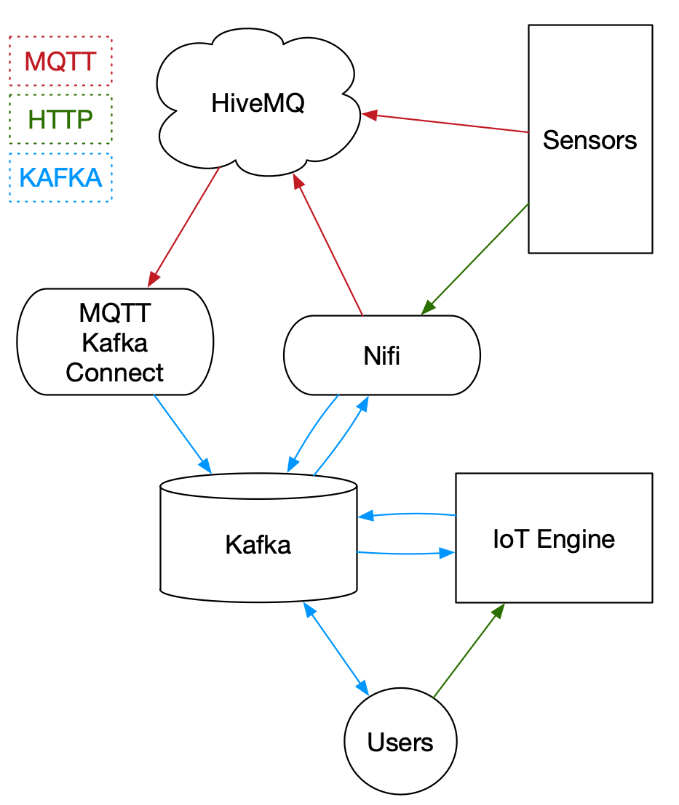
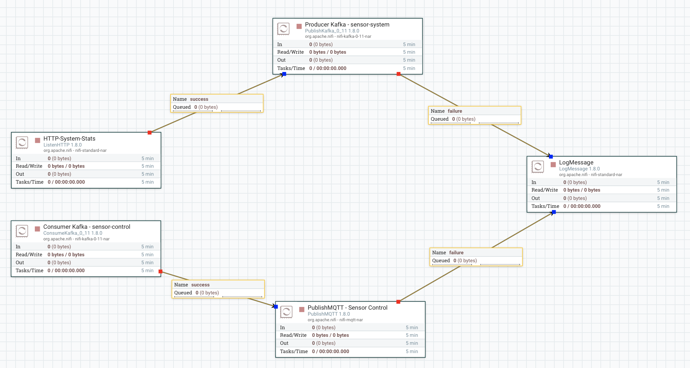
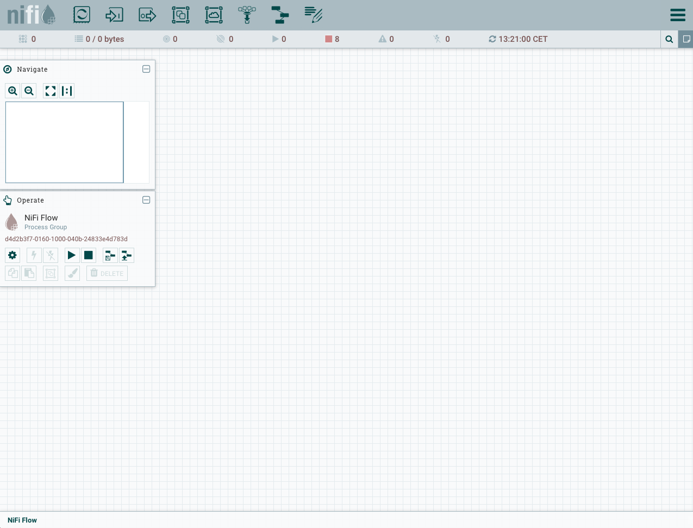
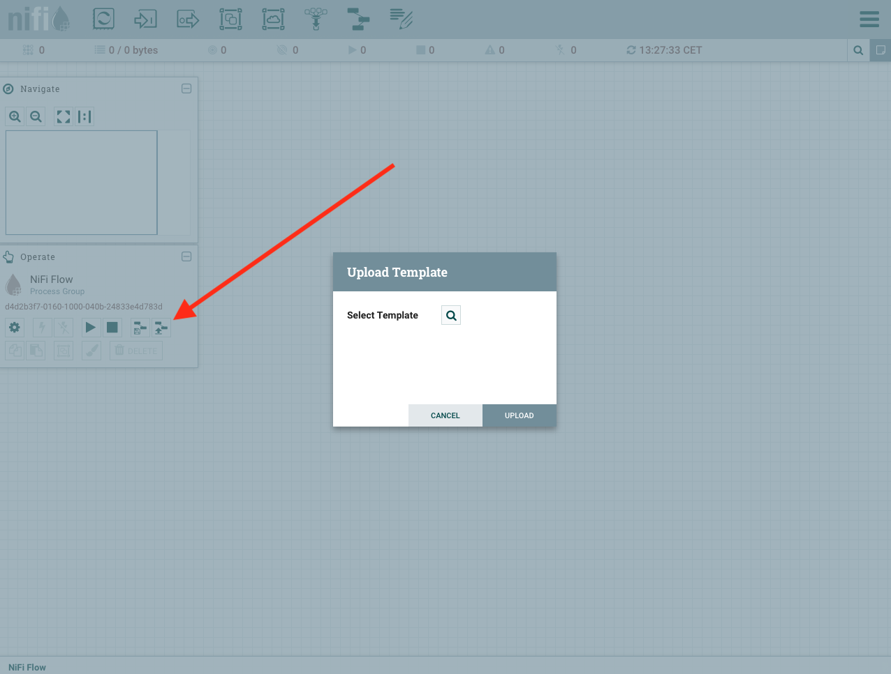
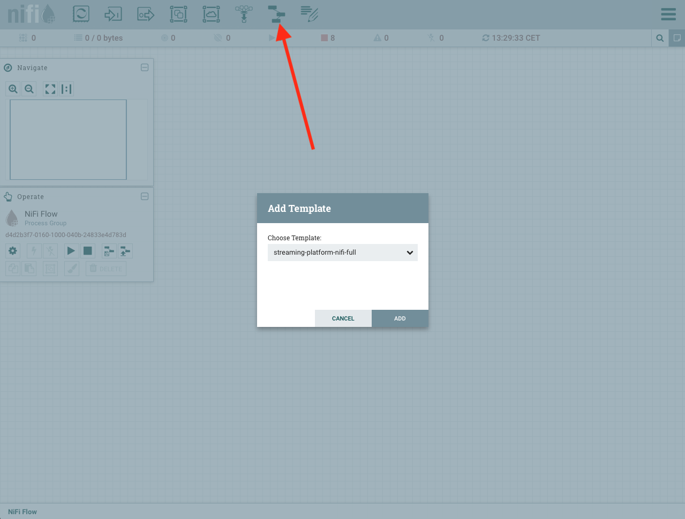
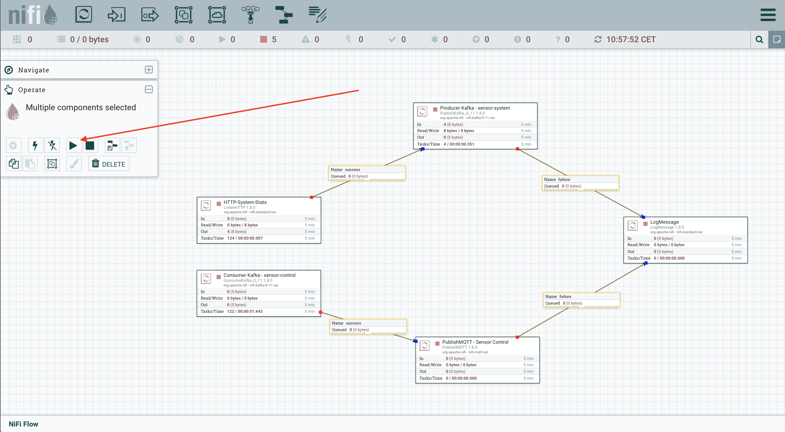

* Do not remove this line (it will not be displayed)
{:toc}

# Arquitectura General



En el diagrama podemos ver la arquitectura del sistema que vamos a implementar, su funcionamiento es el siguiente:

1. Los datos son envios desde 3 sensores que emularemos en docker. Estos datos son enviados mediante MQTT a una broker en la cloud [HiveMQ](https://www.hivemq.com) y mediante peticiones POST HTTP.
2. [Nifi](https://nifi.apache.org) se encarga de atender las peticiones POST HTTP de los sensores, procesarlos y enviarlos a distintos topics de [Kafka](https://kafka.apache.org). Nifi también envía los mensajes de control generados por el motor de streaming, que serán enviados de nuevo al broker en la cloud.
3. Kafka Connect se encargará de consumir los mensajes MQTT de la cloud y enviarlos a Kafka.
4. El [IoT-Engine](https://github.com/andresgomezfrr/iot-engine) es el encargado de leer los mensajes de los sensores desde Kafka y procesarlos, en base a este procesamiento se generarán mensajes de métricas, alertas y control.

## Kafka Topics

En esta sección vamos a analizar los topics de usuario que vamos a utilizar en nuestro sistema.

* **sensor-system** : Es utilizado para enviar los datos del sensor de métricas de sistema.
* **sensor-iot** : Es utilizado para recibir los datos de el sensor de iot.
* **sensor-iot-agg-metrics** : Es utilizado para enviar las métricas desde el Iot-Engine.
* **sensor-iot-alerts** : Es utilizado para enviar las alertas desde el Iot-Engine.
* **iot-rules** : Es utilizado para configurar las reglas en el Iot-Engine.
* **sensor-iot-control** : Es utilizado para enviar ordenes de control a los sensores.

## Nifi Template



Download: [Nifi Template](../data/streaming-platform-v2/nifi-template.xml)

El template de Nifi es el encargado de:  

* Escuchar las peticiones POST desde los sensores y enviarlas a los correspondientes topics de Kafka.
* Consumir desde Kafka los mensajes de control y enviarlos al broker MQTT.

## MQTT Kafka Connect

Consumirá los mensajes de métricas reportados por los sensores y los enviará a Kafka.

# Instalación

## Zookeeper y kafka

Para instalar ZooKeeper y Kafka podemos seguir la guía que tenemos en esta misma web. [Instalación Zookeeper y Kafka](http://datadocs.xyz/kafka/)

## Nifi

### Instalación

En primer lugar tenemos que descargar la distribución, podemos encontrar la última distribución en [Nifi Downloads](http://nifi.apache.org/download.html). Actualmente es la versión 1.8.0.

```
wget http://apache.rediris.es/nifi/1.8.0/nifi-1.8.0-bin.tar.gz
```

Una vez la tenemos la descomprimimos y ya podemos ejecutarlo:

```
tar -xvf nifi-1.8.0-bin.tar.gz; cd nifi-1.8.0/
```

```
# Ejeccución en primer plano
bin/nifi.sh run

# Ejeccución en segundo plano
bin/nifi.sh start
```

Una vez el sistema este operativo podemos acceder a la URL: [http://localhost:8080/nifi](http://localhost:8080/nifi)

### Ejeccución del template

Download: [Nifi Template](../data/streaming-platform-v2/nifi-template.xml)

Al acceder a la URL [http://localhost:8080/nifi](http://localhost:8080/nifi), encontraremos una interfaz como la siguiente:



Una vez vemos la interfaz podemos cargar nuestro template de la siguiente forma, seleccionamos nuestro template y lo cargamos:



Ahora toca agregar nuestro template al flow de Nifi, hacemos un drag&drop de un template y seleccinamos el template que hemos cargado:



Una vez tenemos el template cargado, ya podemos ejecutarlo:




Cuando hayamos finalizado este procedimiento ya tendremos ejecutando nuestro template de Nifi, que se encargara de procesar los mensajes.

## MQTT Kafka Connect

En primer lugar vamos a descargar el proyecto del MQTT connector y haremos la build.

```
git clone https://github.com/wizzie-io/kafka-connect-mqtt
```

```
cd kafka-connect-mqtt; ./gradlew clean jar copyRuntimeLibs
```

Una vez generado el jar lo copiamos dentro de la carpeta `libs` de la distribución de Kafka.

```
cp build/libs/kafka-connect-mqtt-1.1-SNAPSHOT.jar ~/kafka_2.12-2.1.0/libs/
cp build/output/lib/org.eclipse.paho.client.mqttv3-1.0.2.jar ~/kafka_2.12-2.1.0/libs/
```

Creamos el fichero que usaremos para configurar nuestro conector mqtt:
**mqtt.properties**

```properties
name=mqtt
connector.class=com.evokly.kafka.connect.mqtt.MqttSourceConnector
tasks.max=1

#Settings
kafka.topic=sensor-iot
mqtt.client_id=my-id
mqtt.clean_session=true
mqtt.connection_timeout=30
mqtt.keep_alive_interval=60
mqtt.server_uris=tcp://broker.hivemq.com:1883
mqtt.topic=streaming-platform/sensor/metrics
mqtt.qos=1
message_processor_class=com.evokly.kafka.connect.mqtt.sample.StringProcessor
```

Creamos el fichero de configuración de conector:
**connect-standalone.properties**

```properties
bootstrap.servers=<KAFKA_BROKER_SERVER>

key.converter=org.apache.kafka.connect.storage.StringConverter
value.converter=org.apache.kafka.connect.storage.StringConverter
key.converter.schemas.enable=true
value.converter.schemas.enable=false

internal.key.converter=org.apache.kafka.connect.json.JsonConverter
internal.value.converter=org.apache.kafka.connect.json.JsonConverter

offset.storage.file.filename=/tmp/connect.offsets
offset.flush.interval.ms=10000
```

Ejecutamos el conector en este caso vamos a ejecutar el modo standalone para testing:

```
kafka_2.12-2.1.0/bin/connect-standalone.sh kafka_2.12-2.1.0/config/connect-standalone.properties mqtt.properties
```

## Iot-Engine

```
docker run -it -p 5574:5574 -e BOOTSTRAP_SERVERS=<KAFKA_IP_ADDRESS>:9092 -e APPLICATION_ID=iot-engine -e REST_SERVER_ENDPOINT=0.0.0.0:5574 -e TOPIC_AGG=sensor-iot-agg-metrics -e TOPIC_DATA=sensor-iot -e TOPIC_RULE=iot-rules -e TOPIC_ALERT=sensor-iot-alerts -e APPLICATION_SERVER=<MAIN_IP_ADDRESS>:5574 iot-engine:latest
```

## Sensores

Los sensores se pueden encontrar en el github del proyecto, el como construir los docker y ejecutarlos se encuentran en los README.md de cada uno de ellos.

[Sensores](https://github.com/andresgomezfrr/streaming-pipeline-v2/tree/master/sensors)

**iot-sensor**

```
docker run -it -e SENSOR_ID=andres -e MQTT_BROKER_HOST=broker.hivemq.com -e MQTT_BROKER_PORT=1883 -e MQTT_BROKER_TOPIC=streaming-platform/sensor/metrics -e NUM_MESSAGES=10000 -e INTERVAL_MS=1000 -e NUM_THREADS=1 iot-sensor:latest
```

**system-stats-sensor**

```
docker run -it -e HTTP_ENDPOINT=<NIFI_IP_ADDRESS>:7777 -e SENSOR_NAME=sensor1 system-stats-sensor:latest
```

# Docker Compose

Download [docker-compose.yml](../data/streaming-platform-v2/docker-compose.yml)

```yml
version: '3'

services:
  zookeeper:
    image: zookeeper:3.4.13
    restart: always
    environment:
      ZOO_MY_ID: 1
      ZOO_SERVERS: server.1=zookeeper:2888:3888
    volumes:
      - 'zookeeper:/var/lib/zookeeper'
  kafka:
    networks:
      default:
        aliases:
          - ${INTERFACE_IP}
    image: wurstmeister/kafka:2.12-2.1.0
    restart: always
    depends_on:
      - zookeeper
    ports:
      - 9092:9092
    environment:
      KAFKA_ADVERTISED_HOST_NAME: ${INTERFACE_IP:-127.0.0.1}
      KAFKA_ADVERTISED_PORT: 9092
      KAFKA_ZOOKEEPER_CONNECT: zookeeper:2181
      KAFKA_BROKER_ID: 0
      KAFKA_LOG_DIRS: /kafka/kafka-logs
      KAFKA_OFFSETS_TOPIC_REPLICATION_FACTOR: 1
      KAFKA_LOG_RETENTION_BYTES: 1073741824
      KAFKA_LOG_SEGMENT_BYTES: 536870912
      KAFKA_CREATE_TOPICS: "data:1:1,rules:1:1,alerts:1:1,control:1:1,agg-metrics:1:1"
    volumes:
      - 'kafka:/kafka'
  nifi:
    image: apache/nifi:1.8.0
    restart: always
    depends_on:
      - zookeeper
      - kafka
    ports:
      - 8080:8080
      - 7777:7777
    environment:
      NIFI_ZK_CONNECT_STRING: zookeeper:2181
  kafka-connect:
    image: andresgomezfrr/mqtt-kc:1.0.0
    restart: always
    healthcheck:
      test: ["CMD", "curl", "-f", "http://kafka-connect:8083"]
      interval: 20s
      timeout: 3s
      retries: 3
    depends_on:
      - kafka
    ports:
      - 8083:8083
    environment:
       CONNECT_BOOTSTRAP_SERVERS: kafka:9092
       CONNECT_GROUP_ID: kafka-connect-id
       CONNECT_CONFIG_STORAGE_TOPIC: __connect_config
       CONNECT_OFFSET_STORAGE_TOPIC: __connect_offset
       CONNECT_STATUS_STORAGE_TOPIC: __connect_status
       CONNECT_KEY_CONVERTER: org.apache.kafka.connect.storage.StringConverter
       CONNECT_CONFIG_STORAGE_REPLICATION_FACTOR: 1
       CONNECT_STATUS_STORAGE_REPLICATION_FACTOR: 1
       CONNECT_OFFSET_STORAGE_REPLICATION_FACTOR: 1
       CONNECT_KEY_CONVERTER_SCHEMAS_ENABLE: "false"
       CONNECT_VALUE_CONVERTER: org.apache.kafka.connect.storage.StringConverter
       CONNECT_VALUE_CONVERTER_SCHEMAS_ENABLE: "false"
       CONNECT_INTERNAL_KEY_CONVERTER: org.apache.kafka.connect.json.JsonConverter
       CONNECT_INTERNAL_VALUE_CONVERTER: org.apache.kafka.connect.json.JsonConverter
       CONNECT_REST_ADVERTISED_HOST_NAME: kafka-connect
  iot-engine:
   image: andresgomezfrr/iot-engine:1.0.0
   restart: always
   depends_on:
     - kafka
     - kafka-connect
     - nifi
   ports:
     - 5574:5574
   environment:
      REST_SERVER_ENDPOINT: 0.0.0.0:5574
      BOOTSTRAP_SERVERS: kafka:9092
      APPLICATION_ID: iot-engine-id
      APPLICATION_SERVER: ${INTERFACE_IP:-127.0.0.1}:5574

volumes:
  zookeeper:
  kafka:
```

En primer lugar tenemos que crear un fichero `.env` con el siguiente contenido, donde indicamos nuestra interfaz de red principal.

```
INTERFACE_IP=<MAIN_INTERFACE_IP>
```

Otra opción es exportar la variable de entorno `INTERFACE_IP` y posteriormente ejecutar el docker-compose, podemos añadir la opción `-d` para ejecutar en segundo plano. (Siempre en el directorio donde hayamos descargado el docker-compose.yml)

```
docker-compose up
```

Una vez el docker-compose este funcionando:

* Los topics por defecto para el caso de uso se crean automaticamente.
* Tenemos que  configurar nifi como esta explicado previamente.
* Tenemos que configurar el conector MQTT de Kafka Connect, en este caso Kafka Connect trabaja en modo distribuido, por lo que tendremos que hacer lo siguiente:

Crear el fichero `mqtt-connect.json`:

```json
{
  "name": "mqtt",
  "config": {
    "connector.class": "com.evokly.kafka.connect.mqtt.MqttSourceConnector",
    "kafka.topic": "sensor-iot",
    "mqtt.client_id": "my-id-streaming",
    "mqtt.clean_session": "true",
    "mqtt.connection_timeout": "30",
    "mqtt.keep_alive_interval": "60",
    "mqtt.server_uris": "tcp://broker.hivemq.com:1883",
    "mqtt.topic": "streaming-platform/sensor/metrics",
    "mqtt.qos": "1",
    "message_processor_class": "com.evokly.kafka.connect.mqtt.sample.StringProcessor"
  }
}
```

Ejecutar el conector:

```
curl -X POST -H 'Content-Type: application/json' -d @mqtt-connect.json  http://localhost:8083/connectors
```

Podemos verificar si esta operativo:

```
curl http://localhost:8083/connectors
```

* Una vez realizado los puntos anteriores, ya podemos enviar los datos desde los sensores, como esta explicado en el tutorial.
