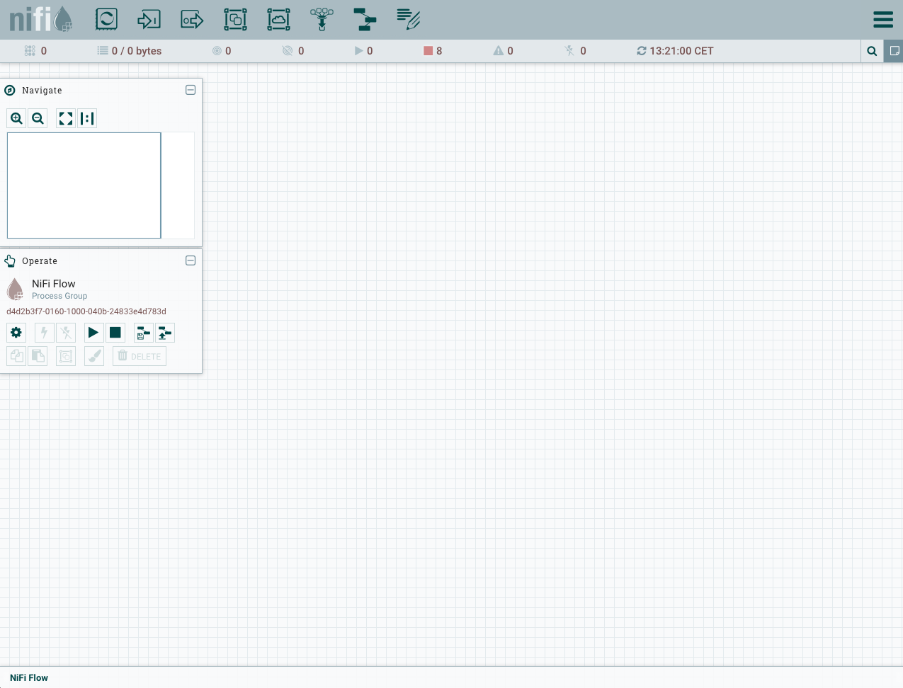
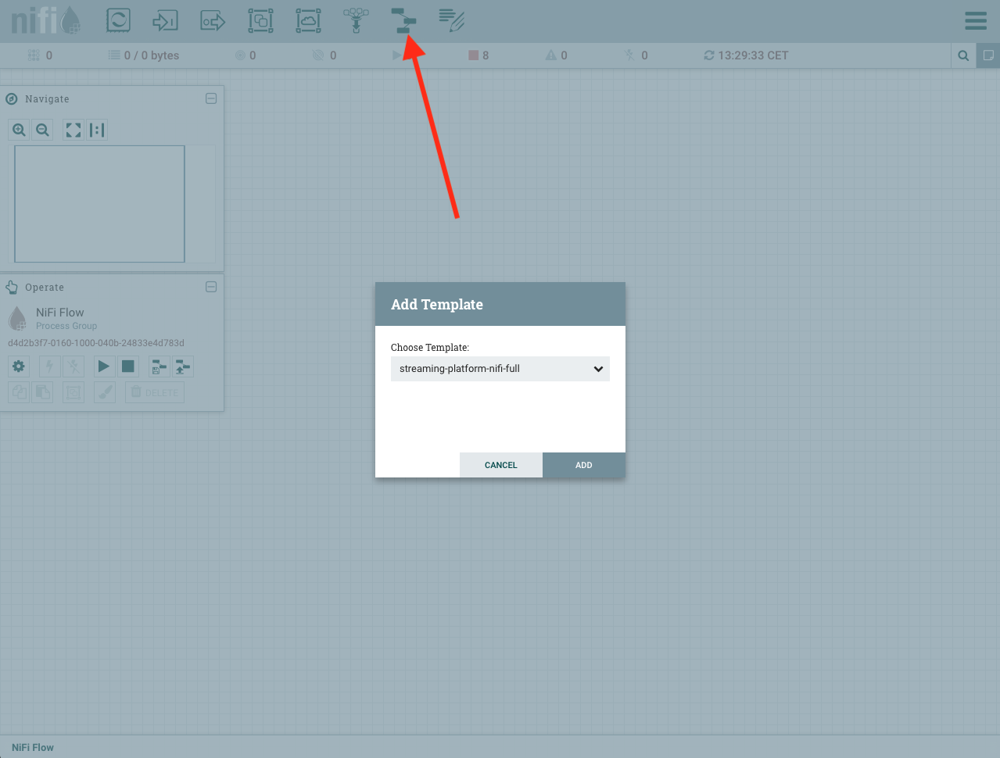

* Do not remove this line (it will not be displayed)
{:toc}

# Arquitectura General


En el diagrama podemos ver la arquitectura del sistema que vamos a implementar, su funcionamiento es el siguiente:

1. Los datos son envios desde los sensores que emularemos en docker. Estos datos son enviados mediante MQTT a una broker en la cloud [HiveMQ](https://www.hivemq.com).
2. [Nifi](https://nifi.apache.org) se encargara de consumir los mensajes de los sensores vía MQTT y de enviarlos a distintos topics de [Kafka](https://kafka.apache.org). Nifi también envía los mensajes de control generados por el motor de streaming, que serán enviados de nuevo al broker en la cloud. Por último, descargara de forma periodica el tiempo de Madrid y lo procesara y lo insertará en un topic de kafka.
3. Kafka Connect se encargará de consumir los metadatos de los sensores desde PostgreSQL.
4. El [IoT-Engine](https://github.com/andresgomezfrr/iot-engine) es el encargado de leer los mensajes de los sensores desde Kafka y procesarlos, en base a este procesamiento se generarán mensajes de métricas, alertas y control.
5. Druid leera estos mensajes de métricas y alertas desde Kafka.
6. Grafana consultará los datos desde Druid y mostrará las visualizaciones.

## Kafka Topics

En esta sección vamos a analizar los topics de usuario que vamos a utilizar en nuestro sistema.

* **sensor-iot** : Es utilizado para recibir los datos de el sensor de iot.
* **sensor-iot-agg-metrics** : Es utilizado para enviar las métricas desde el Iot-Engine.
* **sensor-iot-alerts** : Es utilizado para enviar las alertas desde el Iot-Engine.
* **sensor-iot-control** : Es utilizado para enviar ordenes de control a los sensores.
* **sensor-metadata** : Es utilizado para recibir los metadatos de los sensores de iot.
* **weather** : Es utilizado para recibir los datos del tiempo actual de Madrid.
* **iot-rules** : Es utilizado para configurar las reglas en el Iot-Engine.

## Nifi Template


Download: [Nifi Template](../data/streaming-platform-v3/nifi-template.xml)

## MQTT Kafka Connect

Consumirá los mensajes de métricas reportados por los sensores y los enviará a Kafka.

# Instalación

## Zookeeper y kafka

Para instalar ZooKeeper y Kafka podemos seguir la guía que tenemos en esta misma web. [Instalación Zookeeper y Kafka](http://datadocs.xyz/kafka/)

## Nifi

### Instalación

En primer lugar tenemos que descargar la distribución, podemos encontrar la última distribución en [Nifi Downloads](http://nifi.apache.org/download.html). Actualmente es la versión 1.10.0.

```
wget http://apache.rediris.es/nifi/1.10.0/nifi-1.10.0-bin.tar.gz
```

Una vez la tenemos la descomprimimos y ya podemos ejecutarlo:

```
tar -xvf nifi-1.10.0-bin.tar.gz; cd nifi-1.10.0/
```

```
# Ejeccución en primer plano
bin/nifi.sh run

# Ejeccución en segundo plano
bin/nifi.sh start
```

Una vez el sistema este operativo podemos acceder a la URL: [http://localhost:8080/nifi](http://localhost:8080/nifi)

### Ejeccución del template

Download: [Nifi Template](../data/streaming-platform-v3/nifi-template.xml)

Al acceder a la URL [http://localhost:8080/nifi](http://localhost:8080/nifi), encontraremos una interfaz como la siguiente:



Una vez vemos la interfaz podemos cargar nuestro template de la siguiente forma, seleccionamos nuestro template y lo cargamos:


Ahora toca agregar nuestro template al flow de Nifi, hacemos un drag&drop de un template y seleccinamos el template que hemos cargado:



Una vez tenemos el template cargado, ya podemos ejecutarlo:


Cuando hayamos finalizado este procedimiento ya tendremos ejecutando nuestro template de Nifi, que se encargara de procesar los mensajes.

## MQTT Kafka Connect

[MQTT Kafka Connect](http://datadocs.xyz/kafka/#mqtt-kafka-source-connector)

## Iot-Engine

```
docker run -it -p 5574:5574 -e BOOTSTRAP_SERVERS=<KAFKA_IP_ADDRESS>:9092 -e APPLICATION_ID=iot-engine -e REST_SERVER_ENDPOINT=0.0.0.0:5574 -e TOPIC_AGG=sensor-iot-agg-metrics -e TOPIC_DATA=sensor-iot -e TOPIC_RULE=iot-rules -e TOPIC_ALERT=sensor-iot-alerts -e APPLICATION_SERVER=<MAIN_IP_ADDRESS>:5574 iot-engine:latest
```

## Sensores

Los sensores se pueden encontrar en el github del proyecto, el como construir los docker y ejecutarlos se encuentran en los README.md de cada uno de ellos.

[Sensores](https://github.com/andresgomezfrr/streaming-pipeline-v2/tree/master/sensors)

**iot-sensor**

```
docker run -it -e SENSOR_ID=andres -e MQTT_BROKER_HOST=broker.hivemq.com -e MQTT_BROKER_PORT=1883 -e MQTT_BROKER_TOPIC=streaming-platform/sensor/metrics -e NUM_MESSAGES=10000 -e INTERVAL_MS=1000 -e NUM_THREADS=1 iot-sensor:latest
```

## JDBC Kafka Connect Connector

Configuración JDBC connector  en modo distribuido:

```json
{
    "name": "jdbc-source",
    "config": {
        "connector.class": "io.confluent.connect.jdbc.JdbcSourceConnector",
        "tasks.max": "1",
        "connection.url": "jdbc:postgresql://localhost:5432/postgres",
        "connection.user": "postgres",
        "mode": "bulk",
        "poll.interval.ms": 30000,
        "topic.prefix": "",
        "table.whitelist" : "sensor-metadata",
        "transforms.createKey.type": "org.apache.kafka.connect.transforms.ValueToKey",
        "transforms.createKey.fields": "sensor",
        "transforms": "createKey,extractKey",
        "transforms.extractKey.type": "org.apache.kafka.connect.transforms.ExtractField$Key",
        "transforms.extractKey.field": "sensor"
    }
}
```
