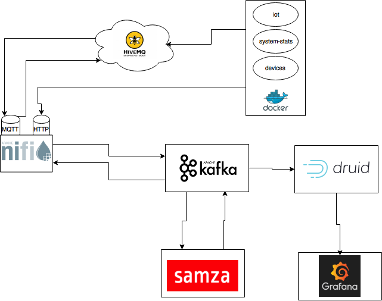
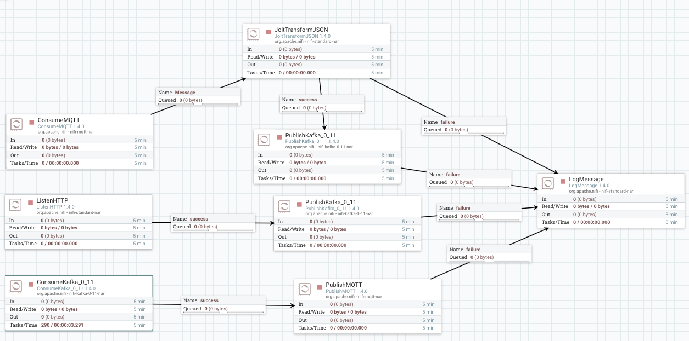
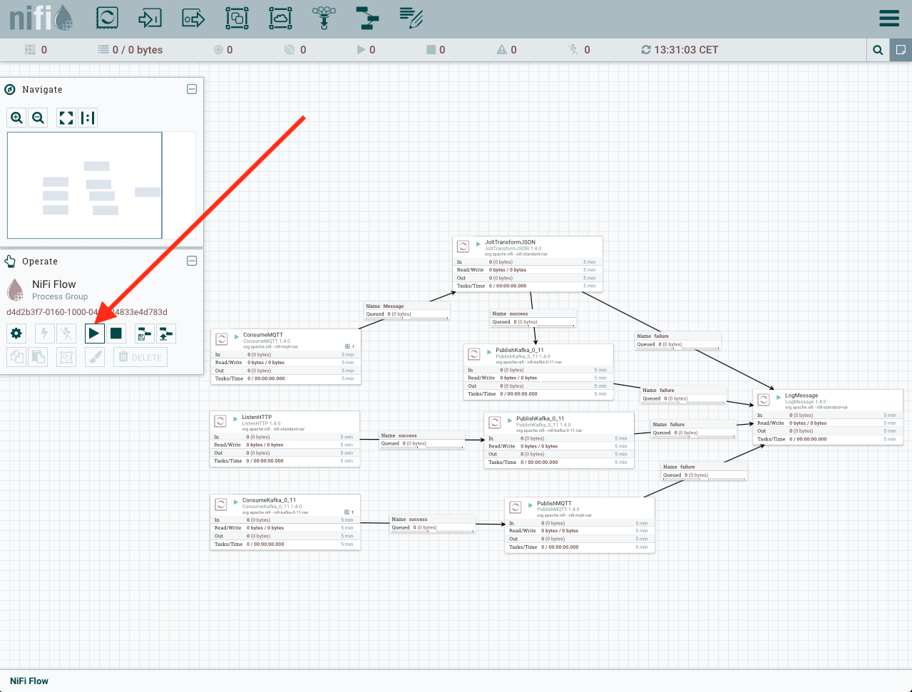

* Do not remove this line (it will not be displayed)
{:toc}

# Arquitectura General



En el diagrama podemos ver la arquitectura del sistema que vamos a implementar, su funcionamiento es el siguiente:

1. Los datos son envios desde 3 sensores que emularemos en docker. Estos datos son enviados mediante MQTT a una broker en la cloud [HiveMQ](https://www.hivemq.com) y mediante peticiones POST HTTP.
2. [Nifi](https://nifi.apache.org) se encarga de consumir los mensajes desde el broker MQTT en la cloud y de atender las peticiones POST HTTP de los sensores, ambas fuentes son procesadas y enviadas a distintos topics de [Kafka](https://kafka.apache.org). Nifi también envía los mensajes de control generados por el motor de streaming, que serán enviados de nuevo al broker en la cloud.
3. [Samza](https://samza.apache.org), que se ejecutará sobre [Hadoop YARN](http://hadoop.apache.org), es el encargado de leer los mensajes de los sensores desde Kafka y procesarlos, en base a este procesamiento se generarán mensajes de métricas y mensajes de control.
4. Druid leerá los mensajes de métricas generados por Samza y los indexará.
5. Finalmente, veremos los datos almacenados en [Druid](https://www.hivemq.com) utilizando una interfaz de visualización que es Grafana.

## Nifi Template



Download: [Nifi Template](../data/streaming-platform/nifi-template.xml)

El template de Nifi es el encargado de:  

* Escuchar las peticiones POST desde los sensores y enviarlas a los correspondientes topics de Kafka.
* Consumir los mensajes del broker MQTT, transformar los JSONs y enviarlos a Kafka.
* Consumir desde Kafka los mensajes de control y enviarlos al broker MQTT.

## Kafka Topics

En esta sección vamos a analizar los topics de usuario que vamos a utilizar en nuestro sistema.

* **sensor-control** : Es utilizado para enviar ordenes de control a los sensores.
* **sensor-iot** : Es utilizado para recibir los datos de el sensor de iot. 
* **sensor-system** : Es utilizado para enviar los datos del sensor de métricas de sistema.
* **sensor-devices** : Es utilizado para enviar los datos del sensor de dispositivos.

# Instalación

## Zookeeper y kafka

Para instalar ZooKeeper y Kafka podemos seguir la guía que tenemos en esta misma web. [Instalación Zookeeper y Kafka](http://datadocs.xyz/kafka/)

## Nifi

### Instalación

En primer lugar tenemos que descargar la distribución, podemos encontrar la última distribución en [Nifi Downloads](http://nifi.apache.org/download.html). Actualmente es la versión 1.4.0.

```
wget http://apache.rediris.es/nifi/1.4.0/nifi-1.4.0-bin.tar.gz
```

Una vez la tenemos la descomprimimos y ya podemos ejecutarlo:

```
tar -xvf nifi-1.4.0-bin.tar.gz; cd nifi-1.4.0/
```

```
# Ejeccución en primer plano
bin/nifi.sh run

# Ejeccución en segundo plano
bin/nifi.sh start
```

Una vez el sistema este operativo podemos acceder a la URL: [http://localhost:8080/nifi](http://localhost:8080/nifi)

### Ejeccución del template

Download: [Nifi Template](../data/streaming-platform/nifi-template.xml)

Al acceder a la URL [http://localhost:8080/nifi](http://localhost:8080/nifi), encontraremos una interfaz como la siguiente:


Una vez vemos la interfaz podemos cargar nuestro template de la siguiente forma, seleccionamos nuestro template y lo cargamos:


Ahora toca agregar nuestro template al flow de Nifi, hacemos un drag&drop de un template y seleccinamos el template que hemos cargado:


Una vez tenemos el template cargado, ya podemos ejecutarlo:




Cuando hayamos finalizado este procedimiento ya tendremos ejecutando nuestro template de Nifi, que se encargara de procesar los mensajes.

## Sensores

Los sensores se pueden encontrar en el github del proyecto, el como construir los docker y ejecutarlos se encuentran en los README.md de cada uno de ellos.

[Sensores](https://github.com/andresgomezfrr/streaming-pipeline/tree/master/sensors)

## Hadoop YARN

Para instalar Hadoop podemos seguir la guía que tenemos en esta misma web. [Instalación Hadoop YARN](http://datadocs.xyz/hadoop/)

## Samza
-

## Druid

Para instalar Druid podemos seguir la guía que tenemos en esta misma web. [Instalación Hadoop YARN](http://datadocs.xyz/druid/)

## Grafana

La instalación de grafana es tan simple como seguir el proceso de su web dependiendo de la distribución que usemos [Grafana Download](https://grafana.com/grafana/download)

Una vez tengamos instalado grafana, debemos añadir el plugin que da el soporte para Druid, que es tan sencillo como ejecutar la siguiente linea:

```
grafana-cli plugins install abhisant-druid-datasource
```
